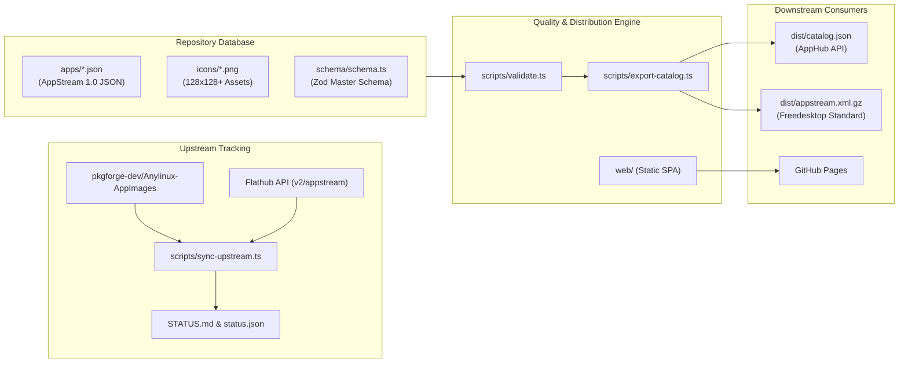

# Developer and Contributor Handbook

Welcome to the AnyLinux Metadata developer handbook. This guide provides comprehensive documentation for engineering, maintaining, and contributing to the metadata catalog.

---

## 1. System Architecture

The repository serves as a decentralized, version-controlled metadata registry for applications distributed via [AnyLinux AppImages](https://github.com/pkgforge-dev/Anylinux-AppImages) that are not available on Flathub.



### Component Roles

- **`apps/`**: The canonical dataset. Each file is named `<slug>.json` and contains Freedesktop AppStream 1.0 metadata, sandbox profiles, and release provenance.
- **`icons/`**: Curated PNG icon assets corresponding 1:1 with applications in `apps/`.
- **`schema/`**: Type definitions, Zod validation schemas, sandbox permission profiles, and the pre-compiled IDE JSON Schema (`app-manifest.json`).
- **`scripts/`**: Automation tooling for synchronization, validation, ingestion, and downstream export.
- **`web/`**: Zero-dependency browser-based single-page application for non-technical community contributors.
- **`tests/`**: Automated schema and invariant test suite.

---

## 2. Environment Setup

The repository is engineered for dual runtime compatibility: it runs natively under both **Bun** and **Node.js**.

### Option A: Bun (Recommended for fast local iteration)

Prerequisites: Bun v1.1 or newer.

```bash
# Clone the repository
git clone https://github.com/pkgforge-dev/Anylinux-Metadata.git
cd Anylinux-Metadata

# Install dependencies
bun install

# Run validation suite
bun run validate
```

### Option B: Node.js

Prerequisites: Node.js v20.11 or newer, npm v10 or newer.

```bash
# Clone the repository
git clone https://github.com/pkgforge-dev/Anylinux-Metadata.git
cd Anylinux-Metadata

# Install dependencies
npm install

# Run validation suite
npm run validate
```

---

## 3. Tooling and Command Reference

A Unix `Makefile` is provided for standard workflows across both runtimes.

| Make Target | Equivalent Command | Description |
| :--- | :--- | :--- |
| `make test` | `npm test` or `bun test` | Executes schema unit tests |
| `make validate` | `npm run validate` | Validates all manifests in `apps/` |
| `make export` | `npm run export` | Compiles `dist/catalog.json` and `dist/appstream.xml.gz` |
| `make sync` | `npm run sync` | Updates differential backlog from upstream & Flathub |
| `make schema` | `npm run generate-schema` | Re-compiles `schema/app-manifest.json` from Zod |
| `make clean` | `rm -rf dist .cache` | Cleans temporary build caches and distribution files |

---

## 4. Metadata Authoring Guide

### 4.1 Manifest Invariants

Every manifest must adhere to these rules:

1. **Naming**: The file must be located at `apps/<slug>.json`, where `<slug>` matches `^[a-z0-9]+(?:-[a-z0-9]+)*$`.
2. **Reverse-DNS App ID**: `appstream.metadata.id` must use a valid reverse-DNS namespace (e.g. `io.github.owner.repo` or `org.domain.app`).
3. **Summary**: A single informative sentence under 200 characters. **Do not end with a period**.
4. **Description AST**: Text descriptions are modeled as an AST array containing `paragraph` and list items (`unordered-list`, `ordered-list`).
5. **SPDX License**: Must be an official identifier from the [SPDX License List](https://spdx.org/licenses/) (e.g. `MIT`, `Apache-2.0`, `GPL-3.0-or-later`).
6. **Main Categories**: At least one main category (`AudioVideo`, `Development`, `Education`, `Game`, `Graphics`, `Network`, `Office`, `Science`, `Settings`, `System`, `Utility`).
7. **Canonical Icon**: Icon must exist in `icons/<slug>.png` and be referenced via:
   `https://raw.githubusercontent.com/pkgforge-dev/Anylinux-Metadata/main/icons/<slug>.png`
8. **Sandbox Profile**: Explicit permissions for network, display, audio, process isolation, filesystem, and IPC.

### 4.2 Creating a New Manifest

You can use the schema file in your editor (VS Code, Neovim, WebStorm) for autocomplete and inline validation:

```json
{
  "$schema": "https://raw.githubusercontent.com/pkgforge-dev/Anylinux-Metadata/main/schema/app-manifest.json",
  "appstream": {
    "type": "manual",
    "metadata": {
      "id": "io.github.example_org.example_app",
      "name": "Example App",
      "summary": "Lightweight example utility for AnyLinux",
      "description": [
        {
          "type": "paragraph",
          "content": [
            {
              "type": "text",
              "value": "Example App provides an efficient, lightweight solution for demonstration purposes."
            }
          ]
        },
        {
          "type": "unordered-list",
          "items": [
            [
              {
                "type": "text",
                "value": "Clean user interface"
              }
            ],
            [
              {
                "type": "text",
                "value": "Zero external dependencies"
              }
            ]
          ]
        }
      ],
      "projectLicense": "MIT",
      "developer": {
        "name": "Example Developers",
        "url": "https://example.org"
      },
      "homepage": "https://example.org",
      "repository": "https://github.com/example-org/example-app",
      "keywords": ["example", "utility", "cli"],
      "categories": ["Utility"]
    },
    "media": {
      "icon": "https://raw.githubusercontent.com/pkgforge-dev/Anylinux-Metadata/main/icons/example-app.png",
      "screenshots": []
    }
  },
  "addedAt": "2026-09-16",
  "origin": {
    "type": "third-party"
  },
  "releaseSource": {
    "type": "github",
    "repository": "pkgforge-dev/example-app-AppImage"
  },
  "sandbox": {
    "network": "none",
    "display": "none",
    "audio": "none",
    "processes": "isolated",
    "ipc": false,
    "filesystem": [],
    "devices": [],
    "sessionBus": { "access": "none", "rules": [] },
    "systemBus": { "access": "none", "rules": [] }
  }
}
```

---

## 5. Downstream Export Specification

Running `npm run export` or `bun run export` generates downstream artifacts in `dist/`:

### 5.1 JSON Catalog (`dist/catalog.json`)
A unified dictionary mapping application slugs to their full metadata manifests. Designed for consumption by modern package managers such as:
- [AppHub](https://github.com/pkgforge-dev/apphub)
- [AppManager (`am`)](https://github.com/ivan-hc/AM)
- [Soar](https://github.com/pkgforge/soar)

### 5.2 AppStream Collection XML (`dist/appstream.xml.gz`)
A standard Freedesktop AppStream 1.0 XML catalog collection compressed with Gzip. Follows standard `<components version="1.0" origin="anylinux">` structure containing `<component type="desktop">` entries for desktop environments, GNOME Software, KDE Discover, and `appstreamcli`.

---

## 6. Web Editor (`web/`)

The repository includes a static web editor located in `web/`:
- Zero external runtime dependencies; can be served by any static web server (e.g. `python3 -m http.server 8000` from `web/`).
- Automatically deployed to GitHub Pages via `.github/workflows/deploy-pages.yml`.
- Allows contributors to enter app metadata, validate in real-time, preview icons, and automatically generate GitHub issue submissions or JSON manifests.

To test the web editor locally:
```bash
python3 -m http.server 8000 --directory web
```
Then navigate to `http://localhost:8000` in your web browser.

---

## 7. CI/CD Pipeline

The project utilizes automated GitHub Actions workflows:

1. **`validate-pr.yml`**: Triggers on pull requests to `main`. Executes unit tests, validates all manifests against the schema, confirms icon asset presence, and posts an automated summary card.
2. **`sync-upstream.yml`**: Daily scheduled cron job. Runs `scripts/sync-upstream.ts` to diff against `pkgforge-dev/Anylinux-AppImages` and Flathub. Opens an automated update PR when backlog changes occur.
3. **`issue-to-pr.yml`**: Triggers when a contributor submits the GitHub Issue Form (`add-app.yml`). Automatically converts the form inputs into a verified manifest and creates a pull request.
4. **`deploy-pages.yml`**: Triggers on pushes to `main`. Builds catalog artifacts and deploys the static web editor and compiled catalog to GitHub Pages.
