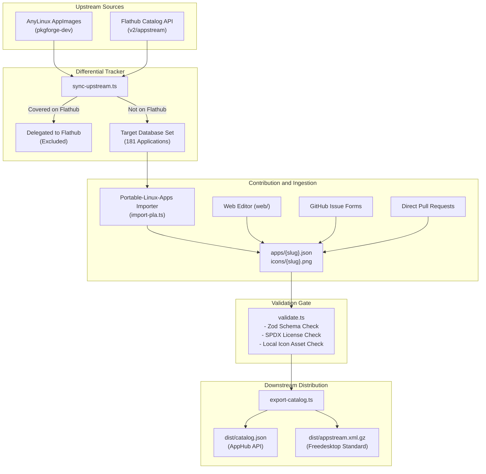

# AnyLinux Metadata Database

[](https://github.com/pkgforge-dev/Anylinux-Metadata/actions)
[](https://creativecommons.org/publicdomain/zero/1.0/)
[](STATUS.md)

A community-maintained, Freedesktop AppStream-compliant metadata database for [AnyLinux AppImages](https://github.com/pkgforge-dev/Anylinux-AppImages) that are not distributed via Flathub.

[Catalog Status](STATUS.md) | [Contributing Guide](CONTRIBUTING.md) | [JSON Schema](schema/app-manifest.json) | [Web Editor](https://pkgforge-dev.github.io/Anylinux-Metadata/)

---

## Overview

The [AnyLinux AppImages](https://github.com/pkgforge-dev/Anylinux-AppImages) repository packages hundreds of standalone, dependency-free portable Linux applications using `sharun` and `uruntime`. While applications published on Flathub already provide standardized AppStream metadata (descriptions, categories, licensing, screenshots, and icons), numerous specialized utilities, terminal emulators, emulators, game engines, and native tools packaged for AnyLinux do not exist on Flathub.

This repository provides a dedicated, version-controlled metadata database for those non-Flathub applications. It serves as an upstream catalog for software storefronts, application managers, and desktop environments.

### Core Objectives

- **AppStream Specification Compliance**: Strict adherence to the Freedesktop AppStream 1.0 standard, reverse-DNS naming conventions, abstract syntax tree (AST) descriptions, verified SPDX 2.0+ licensing, and standardized category taxonomy.
- **Continuous Upstream Synchronization**: Automated daily differential tracking between `pkgforge-dev/Anylinux-AppImages` and the Flathub catalog to detect newly added, retired, or migrated packages.
- **Multi-Tier Contribution Model**: Support for contributions via web form interfaces, automated GitHub issue templates, and direct Git pull requests with automated validation.
- **Multi-Format Downstream Export**: Compilation into unified JSON catalogs (`dist/catalog.json`) and standard AppStream XML collections (`dist/appstream.xml.gz`) for consumption by downstream tools such as [AppHub](https://github.com/pkgforge-dev/apphub), [AppManager (`am`)](https://github.com/ivan-hc/AM), and [Soar](https://github.com/pkgforge/soar).

---

## Architecture



### Pipeline Overview

1. **Differential Tracking (`scripts/sync-upstream.ts`)**: Cross-references all applications in `pkgforge-dev/Anylinux-AppImages` with Flathub's catalog API. Applications present on Flathub are delegated to Flathub; non-Flathub applications form the target backlog.
2. **Metadata Ingestion and Authoring**: Manifests and icons are sourced from `Portable-Linux-Apps.github.io`, the browser-based Web Editor, or community pull requests.
3. **Automated Quality Gate (`scripts/validate.ts`)**: Enforces reverse-DNS naming, SPDX 2.0+ license syntax, description AST integrity, and local icon file existence.
4. **Catalog Compilation (`scripts/export-catalog.ts`)**: Produces unified `dist/catalog.json` and gzipped Freedesktop `dist/appstream.xml.gz` artifacts.

---

## Specification and Manifest Example

Every application manifest is stored in `apps/<slug>.json` and must validate against the schema defined in [`schema/schema.ts`](schema/schema.ts).

```json
{
  "$schema": "https://raw.githubusercontent.com/pkgforge-dev/Anylinux-Metadata/main/schema/app-manifest.json",
  "appstream": {
    "type": "manual",
    "metadata": {
      "id": "io.github.ghostty_org.ghostty",
      "name": "Ghostty",
      "summary": "Fast, feature-rich, GPU-accelerated terminal emulator",
      "description": [
        {
          "type": "paragraph",
          "content": [
            {
              "type": "text",
              "value": "Ghostty is a fast, feature-rich, cross-platform terminal emulator designed by Mitchell Hashimoto. Built from the ground up in Zig, it leverages GPU hardware acceleration to deliver ultra-low latency and high rendering throughput."
            }
          ]
        },
        {
          "type": "unordered-list",
          "items": [
            [
              {
                "type": "text",
                "value": "GPU-accelerated text rendering delivering instant keystroke response"
              }
            ],
            [
              {
                "type": "text",
                "value": "Native desktop integration with tabs, splits, and custom fonts"
              }
            ]
          ]
        }
      ],
      "projectLicense": "MIT",
      "developer": {
        "name": "Ghostty Developers",
        "url": "https://ghostty.org"
      },
      "homepage": "https://ghostty.org",
      "repository": "https://github.com/pkgforge-dev/ghostty-appimage",
      "keywords": ["ghostty", "terminal", "emulator", "cli"],
      "categories": ["System", "TerminalEmulator"]
    },
    "media": {
      "icon": "https://raw.githubusercontent.com/pkgforge-dev/Anylinux-Metadata/main/icons/ghostty.png",
      "screenshots": [
        {
          "caption": "Ghostty terminal window",
          "source": "https://raw.githubusercontent.com/pkgforge-dev/Anylinux-AppImages/main/assets/banner.png"
        }
      ]
    }
  },
  "addedAt": "2026-09-16",
  "origin": {
    "type": "third-party"
  },
  "releaseSource": {
    "type": "github",
    "repository": "pkgforge-dev/ghostty-appimage"
  },
  "sandbox": {
    "network": "full",
    "display": "wayland-or-x11",
    "audio": "none",
    "processes": "isolated",
    "ipc": true,
    "filesystem": [],
    "devices": ["gpu"],
    "sessionBus": { "access": "none", "rules": [] },
    "systemBus": { "access": "none", "rules": [] }
  }
}
```

---

## Project Structure

| Path | Purpose |
| :--- | :--- |
| `apps/` | Canonical application manifests (`apps/<slug>.json`) |
| `icons/` | Curated 128x128 and 256x256 PNG and SVG icons |
| `schema/` | TypeScript Zod schemas, sandbox specification, and compiled `app-manifest.json` |
| `scripts/` | Maintenance tooling (`validate.ts`, `sync-upstream.ts`, `import-pla.ts`, `export-catalog.ts`) |
| `tests/` | Automated unit test suite executed via `bun test` |
| `web/` | Browser-based visual metadata editor SPA |
| `.github/` | GitHub issue templates, PR preview bot, and scheduled synchronization workflows |
| `STATUS.md` | Real-time catalog coverage metrics and pending backlog |
| `package.json` | Project configuration and scripts |
| `tsconfig.json` | TypeScript configuration |

---

## Tooling and Usage

### Prerequisites

- [Bun](https://bun.sh) (v1.1 or later) or Node.js (v20 or later)

### Common Commands

Install dependencies:
```bash
bun install
```

Execute unit test suite:
```bash
bun test
```

Validate all application manifests against the schema:
```bash
bun run validate
```

Synchronize tracking data against upstream AnyLinux AppImages and Flathub:
```bash
bun run sync
```

Import application metadata from Portable-Linux-Apps:
```bash
# Import default batch (18 applications)
bun run import

# Import all matchable applications
bun run import --all
```

Export downstream distribution artifacts:
```bash
bun run export
```

Regenerate IDE JSON Schema:
```bash
bun run generate-schema
```

---

## Contributing

Contributions are welcome. Submissions can be made through several channels depending on technical preference:

1. **Web Editor**: Use the [AnyLinux Metadata Editor](https://pkgforge-dev.github.io/Anylinux-Metadata/) to enter information with real-time schema validation, description formatting, and asset testing.
2. **Issue Forms**: Submit an application using the [Application Submission Form](../../issues/new?template=add-app.yml). An automated workflow will parse the submission, run validation, and generate a pull request.
3. **Pull Requests**: Submit manifests directly to `apps/<slug>.json` and corresponding icons to `icons/<slug>.png`.

Detailed metadata standards, validation rules, and naming requirements are available in [CONTRIBUTING.md](CONTRIBUTING.md).

---

## Downstream Integration

Downstream package managers, application storefronts, and desktop environments can integrate with this database through two standardized formats:

- **JSON Catalog**: Compiled to `dist/catalog.json`, containing an index of all applications, their AppStream metadata, sandboxing profiles, and release repositories.
- **AppStream Collection XML**: Compiled to `dist/appstream.xml` and compressed as `dist/appstream.xml.gz` in standard Freedesktop XML format for integration with tools like GNOME Software, KDE Discover, and `appstreamcli`.

---

## License

All catalog metadata, manifests, and documentation in this repository are dedicated to the public domain under the [Creative Commons Zero (CC0 1.0 Universal)](https://creativecommons.org/publicdomain/zero/1.0/) public domain dedication.

Application names, logos, trademarks, and media assets remain the property of their respective upstream copyright holders.
